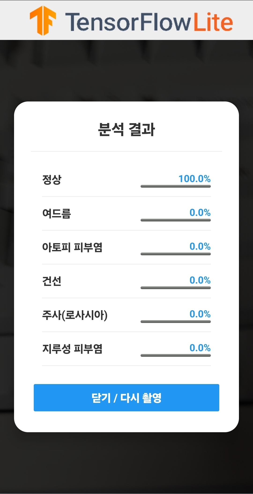

# TensorFlow Examples

    

## Skin Classification (Android)

TensorFlow Lite 기반 피부 질환 분류 Android 앱입니다. 카메라로 촬영한 피부 이미지를 온디바이스 모델(`model_float16.tflite`)로 분석하여 6개 클래스별 확률을 보여줍니다.

- 분류 클래스: 여드름, 아토피 피부염, 정상, 건선, 주사(로사시아), 지루성 피부염
- 소스 위치: [lite/examples/image_classification/android](./lite/examples/image_classification/android)

   
  분석 결과 화면 예시

> ⚠️ 본 앱의 결과는 참고용이며 의학적 진단을 대신하지 않습니다. 피부 이상이 의심되면 전문의와 상담하세요.

<h2>Most important links!</h2>

* [Community examples](./community)
* [Course materials](./courses/udacity_deep_learning) for the [Deep Learning](https://www.udacity.com/course/deep-learning--ud730) class on Udacity

If you are looking to learn TensorFlow, don't miss the
[core TensorFlow documentation](http://github.com/tensorflow/docs)
which is largely runnable code.
Those notebooks can be opened in Colab from
[tensorflow.org](https://tensorflow.org).

<h2>What is this repo?</h2>

This is the TensorFlow example repo.  It has several classes of material:

* Showcase examples and documentation for our fantastic [TensorFlow Community](https://tensorflow.org/community)
* Provide examples mentioned on TensorFlow.org
* Publish material supporting official TensorFlow courses
* Publish supporting material for the [TensorFlow Blog](https://blog.tensorflow.org) and [TensorFlow YouTube Channel](https://youtube.com/tensorflow)

We welcome community contributions, see [CONTRIBUTING.md](CONTRIBUTING.md) and, for style help,
[Writing TensorFlow documentation](https://www.tensorflow.org/community/contribute/docs_style)
guide.

To file an issue, use the tracker in the
[tensorflow/tensorflow](https://github.com/tensorflow/tensorflow/issues/new?template=20-documentation-issue.md) repo.

## License

[Apache License 2.0](LICENSE)
